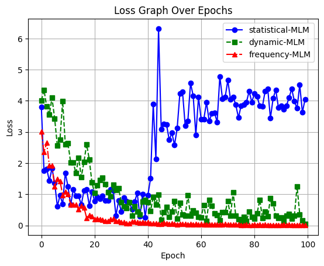

   


## KRLawBERT : A Tailored BERT Model for Korean Legal Texts

## Abstract :
In this work, we presents the development and utilization of ***KRLawBERT***, a specialized variant of **BERT (Bidirectional Encoder Representations from Transformers)**, designed for the intricate domain of Korean legal texts. ***KRLawBERT*** is pre-trained on a large-scale legal text dataset, employing innovative techniques such as **Masked Language Modeling (MLM)** and **Transformer-based Sequential Denoising Auto-Encoder (TSDAE)** to enhance its performance in legal information retrieval. The research provides a comprehensive guide on the pre-training of ***KRLawBERT*** using various masking strategies and its subsequent fine-tuning on datasets tailored to legal semantics.

## 1. Model description

### 1.1. Introduction to KRLawBERT
***KRLawBERT*** is introduced as a specialized **BERT** model tailored for Korean legal texts. It is pre-trained on a large-scale legal text dataset, and its development includes the application of advanced techniques such as MLM and TSDAE to improve its competitive edge in the field of legal information retrieval.

### 1.2. Lexicographical Development of KRLawBERT
 Our research delves into the lexicographical development of ***KRLawBERT***, detailing the application of various MLM approaches to enhance its performance. Four masking techniques—Statistical MLM, Dynamic MLM, Frequency MLM, and TSDAE—are employed to adapt the model to the nuances of the Korean legal language.


## 2. Model Usage

### 2.1. Pre-training KRLawBERT on Specific Text Data
The pre-training of ***KRLawBERT*** is explicated through the implementation of four masking strategies: Statistical MLM, Dynamic MLM, Frequency MLM, and TSDAE. Each approach exposes the model to different training data patterns, catering to diverse downstream tasks. Users are provided with a step-by-step guide for executing these pre-training strategies.


#### 1. Statistical MLM (Statistical Masked Language Modeling)
**Statistical MLM** is implemented with a PyTorch script using the BERT architecture and Hugging Face's Transformers library. This script trains an original MLM on a custom dataset, allowing users to set the masking ratio. According to the BERT paper, excellent performance is achieved at a ratio of 15%, and experimental results suggest the model learns well in the range of 15-20%.

```python
$ python pre-training/statistical-MLM.py
```


#### 2. Dynamic MLM (Dynamic Masked Language Modeling)
**Dynamic MLM** is implemented with a PyTorch script using the BERT architecture and Transformers library. This script employs a dynamic masking strategy similar to RoBERTa, exposing the model to a more diverse set of masked tokens during pretraining. Users can set the masking percentage within the provided code.

```python
$ python pre-training/dynamic-MLM.py
```


#### 3. Frequency-based MLM (Frequency-based Masked Language Modeling)
**Frequency-based MLM** is implemented with a PyTorch script using the BERT architecture and Transformers library. This script employs an advanced masking strategy based on token frequency, concentrating training on high-frequency tokens. Users can set the rate for increased MLM learning on high-frequency tokens.

```python
$ python pre-training/frequency-MLM.py
```


#### 4. TSDAE(Transformer-based Sequential Denosing Auto-Encoder)
**TSDAE** introduces noise to input sequences by deleting or swapping tokens, encoding damaged sentences into sentence vectors, and attempting to reconstruct the original input from the encoded sentence. Unlike traditional MLM, TSDAE's decoder only has access to the sentence vector, making it a distinctive pre-training approach.
```python
$ python pre-training/TSDAE.py
```

Now, you have three distinct MLM (Statistical, Dynamic, Frequency-based) and TSDAE pre-training strategies to choose from based on your specific use case and evaluation results. Each strategy exposes the model to different training data patterns, potentially benefiting various downstream tasks.
```python
$ python pre-training/train_loss_graph.py
```

<p align="center"></p>


### 2.2. Fine-tuning KRLawBERT for Legal Information Retrieval

 To adapt ***KRLawBERT*** for legal information retrieval, the model undergoes a supervised fine-tuning process on three distinct datasets: **Natural Language Inference (NLI)** pairs, **Semantic Textual Similarity (STS)**, and parallel legal data. This fine-tuning approach ensures that ***KRLawBERT*** produces semantic legal embeddings tailored to the specific requirements of the legal domain.
```python
$ python fine-tuning/fine_tuning.py
```


## 3. Conclusion
In summary, this work contributes a specialized **BERT** model, ***KRLawBERT***, designed to excel in the domain of Korean legal texts. Through advanced pre-training and fine-tuning strategies, ***KRLawBERT*** aims to elevate the accuracy and effectiveness of legal information retrieval systems.


## 4. Development
- Seoul National University NLP Labs
- Under the guidance of Navy Lee
